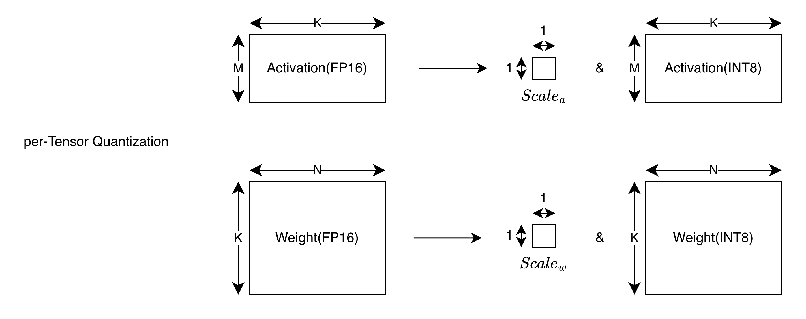
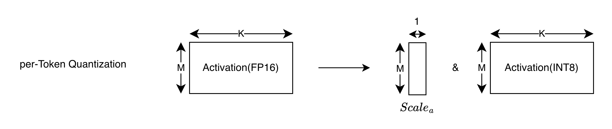
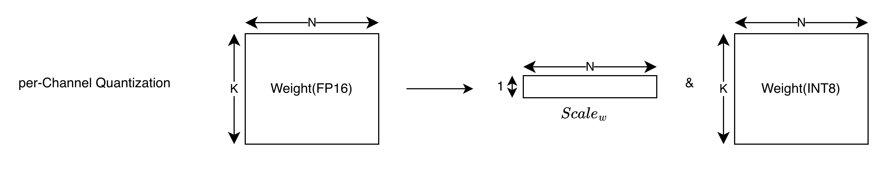
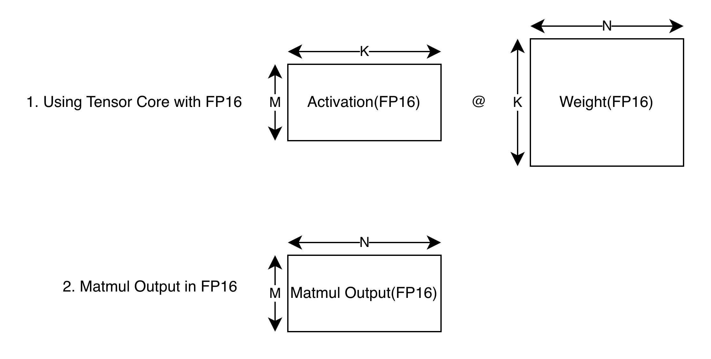
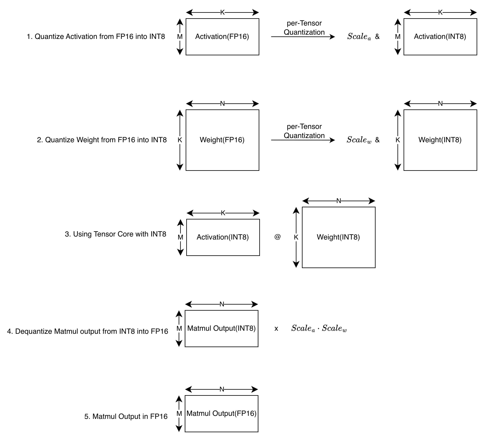
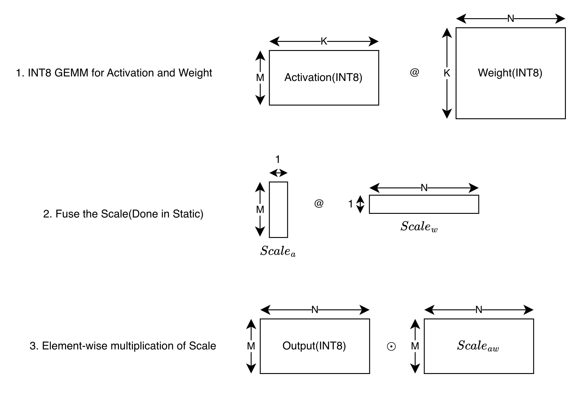
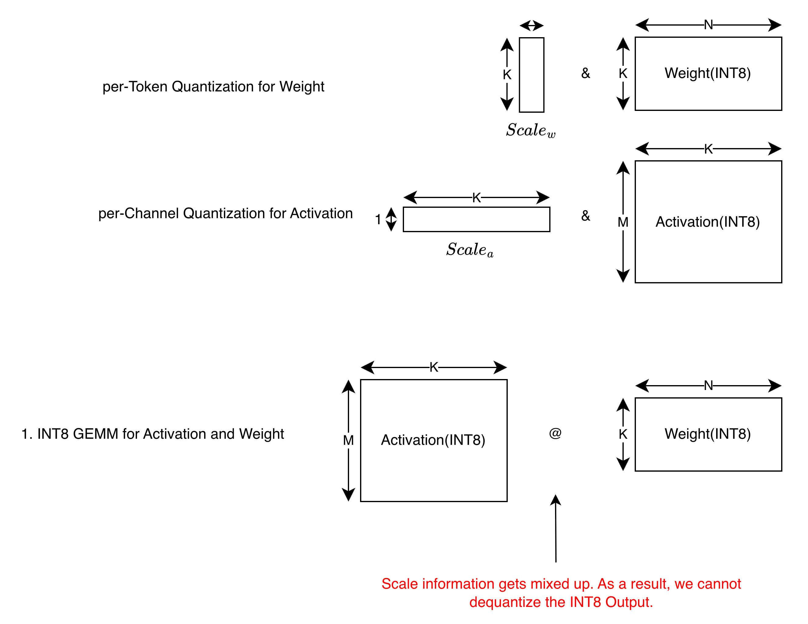

## Summary

There are many quantization schemes: per-Tensor, per-Token, per-Channel etc.

Can we apply any quantization scheme to Activation and Weight to achieve better performance? The answer is no. Quantization scheme should be selected carefully, and need to be compatible with hardware.

> In this post, I will only focus on symmetric quantization scheme.

## Preliminary Knowledge

### per-Tensor Quantization

In per-tensor quantization, we quantize the entire tensor using a single scale factor.

### per-Token Quantization

In per-token quantization, we quantize each token of the tensor using a different scale factor.(We usually refer `token` as the input dimension of the activation matrix)

### per-Channel Quantization

In per-channel quantization, we quantize each channel of the tensor using a different scale factor.(We usually refer `channel` as the output dimension of the weight matrix)

## Checking HW Compatibility

Let's check if each of the quantization scheme combination is compatible with HW. I will assume that you can implement basic GEMM CUDA Kernel, and know the roles of Tensor Core.

### Case 1: GEMM without Quantization

### Case 2: GEMMM with per-Tensor Quantization for Activation and Weight

> This case is HW compatible.

In this case, we can implement GEMM in the following way:

### Case 3: GEMM with per-Token Quantization for Activation and per-Channel Quantization for Weight

> This case is HW compatible.

In this case, we can implement GEMM in the following way:

### Case 4: GEMM with per-Channel Quantization for Activation and per-Token Quantization for Weight

> This case is HW incompatible!

In this case, using INT8 Tensor Core is not possible. We cannot dequantize the INT8 Output matrix into FP16. This is because scale information gets mixed up.

