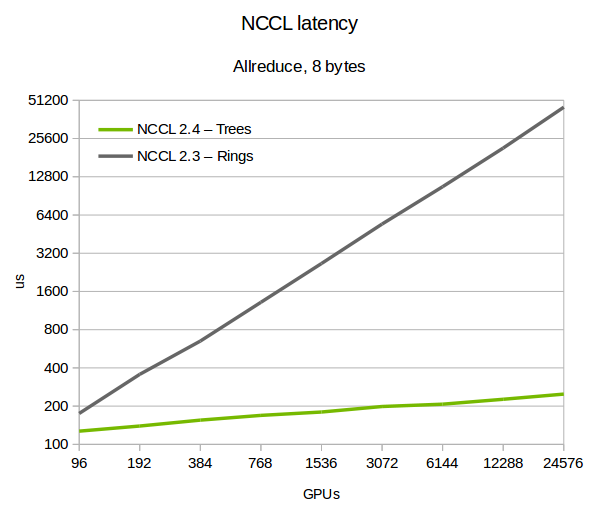
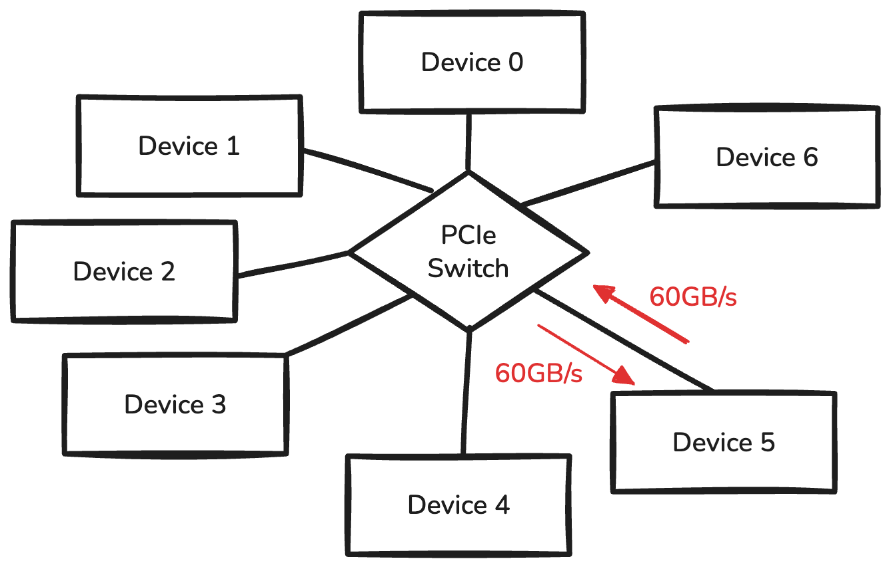
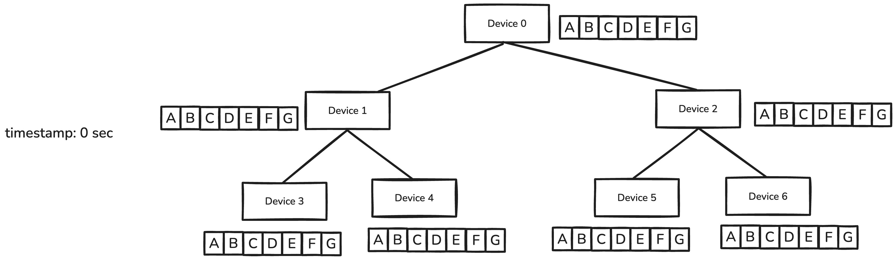
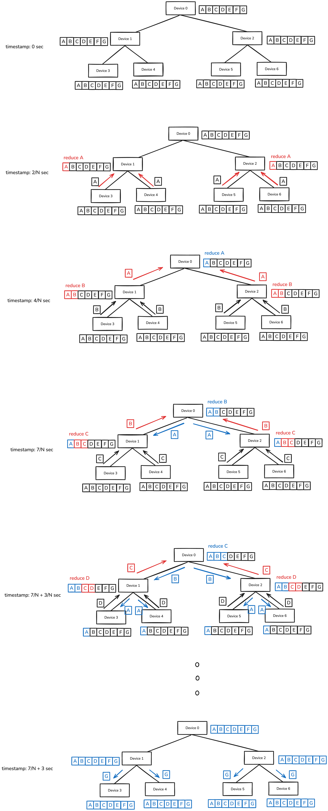
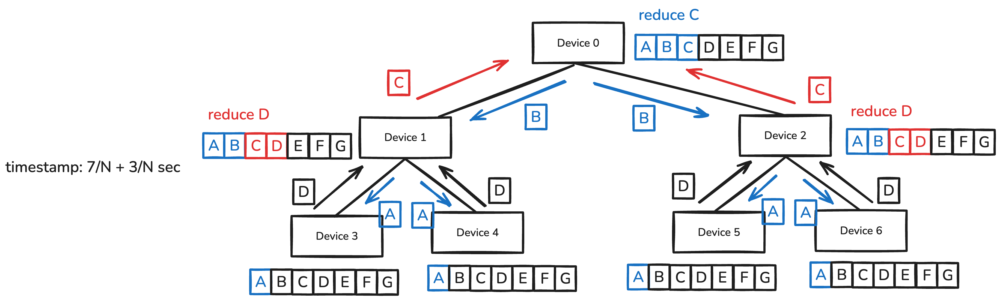
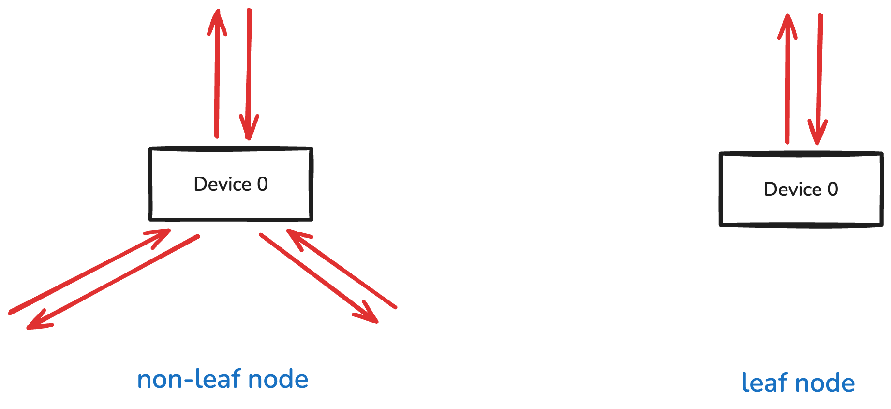

Please check [Ring All Reduce Algorithm](../ring-all-reduce/) first.

## Summary

> I will say "Tree algorithm" instead of "Tree All Reduce Algorithm" and "Ring algorithm" instead of "Ring All Reduce Algorithm".

At first glance, it seems that Tree algorithm is better than Ring algorithm. 

But it is not always true.

Tree algorithm is better than Ring algorithm when the data size is small. (Figure above is for 8 bytes of data)

In this post, I will explain the Tree algorithm and compare it with Ring algorithm.

## Assumptions

Assume we have 7 devices, and we want to perform all-reduce operation. Each device is connected to PCIe switch, and the link is full-duplex with 60GB/s bandwidth.

We also assume each device has 60GB of data.

## Naive Tree Algorithm

### Implementation

Tree allReduce algorithm starts by making a binary-tree structure with the devices.

Starting from the leaf nodes, each device sends its data to the parent node. And the parent node performs the reduce operation. After the final reduce operation at the root node, the result is broadcasted to all the devices.

Assume $N$ is the number of devices, and data is split into $N$ chunks.

Black-contour data chunks are the original data, red-contour data chunks are the intermediate results, and blue-contour data chunks are the final allReduce result.

Note that this algorithm works in pipeline fashion.

The timestamp jumps $2/N$ or $3/N$ when two or three devices try to send $1/N$ size data to single device. 
This is because there is only a single link between PCIe switch and device.

### Time Complexity of Naive Tree Algorithm

In general, for $N$ devices, $W$ bytes/s bandwidth, and $B$ bytes of data, naive tree algorithm takes $(3+2\cdot3\cdot\log_2(N)/N) \cdot \frac{B}{W}$ seconds to complete the allReduce operation.

The pipeline tail latency takes $2\cdot3\cdot\log_2(N)/N \cdot \frac{B}{W}$ seconds.

After the pipeline is filled, it takes $N\cdot3/N=3$ units of $\frac{B}{W}$ seconds to complete the allReduce operation.

> Rewind: Ring algorithm takes $\frac{2(N-1)}{N} \cdot \frac{B}{W}$ seconds to complete the allReduce operation for $B$ bytes of data.

As you can see, naive tree algorithm takes longer time than ring algorithm. Let's refine it!

### Downside of Naive Tree Algorithm

The downside of the naive tree algorithm is the discrepancy between leaf nodes and non-leaf nodes.

Assume the pipeline is filled.

The leaf node has $1/N$ inbound data and $1/N$ outbound data.

The non-leaf node has $3/N$ inbound data and $3/N$ outbound data.

As a result, the leaf node has to wait for the non-leaf node to finish the transmission. This waiting occurs because the data transmission pattern is not balanced between leaf nodes and non-leaf nodes.

Let's look at the refined tree algorithm, double-tree algorithm.

## Double Tree Algorithm

### Implementation

Double-tree algorithm is a refinement of the naive tree algorithm. It aims to balance the data transmission pattern between leaf nodes and non-leaf nodes.

Double tree algorithm makes two trees(Tree 1 and Tree 2). The leaf nodes of Tree 1 are non-leaf nodes in Tree 2. And the non-leaf nodes of Tree 1 are leaf nodes in Tree 2.

The data is evenly divided into two chunks.(Chunk 1 and Chunk 2)

Tree 1 processes the allReduce of Chunk 1, and Tree 2 processes the allReduce of Chunk 2.

### Time Complexity of Double Tree Algorithm

In general, for $N$ devices, $W$ bytes/s bandwidth, and $B$ bytes of data, double-tree algorithm takes $(2+2\cdot4\cdot\log_2(N)/N) \cdot \frac{B}{W}$ seconds to complete the allReduce operation.

The pipeline tail latency takes $2\cdot4\cdot\log_2(N)/N \cdot \frac{B}{W}$ seconds.

After the pipeline is filled, it takes $(N/2)\cdot4/N=2$ units of $\frac{B}{W}$ seconds to complete the allReduce operation.

> You may notice that the time complexity of double-tree algorithm is not better than ring algorithm. This is absolutely correct. But in small data size(where pipeline is barely filled), double-tree algorithm has much better latency than ring algorithm.

Let's take a look at the figure I showed you earlier. It shows the comparison between ring algorithm and double-tree algorithm. It is evaluated with 8 bytes of data.(which is extremely small, and double-tree algorithm's pipeline will not be filled in this case). Given small datasize, the time complexity of ring algorithm is $O(N)$, and the time complexity of double-tree algorithm is $O(\log_2(N))$.

