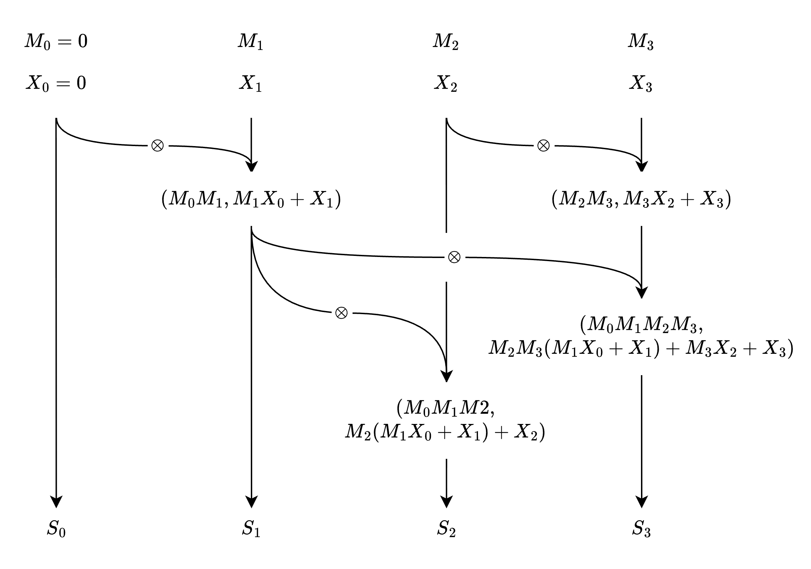

## Prerequisites

Please read [Mathematical Formulation of Linear Attention](../linear-attention/) first.

## Summary

DeltaNet applies the delta rule to linear attention, treating the state matrix as a regression model that maps keys to values. While a naive parallel scan approach leads to prohibitive $O(Ld^3\log L)$ time complexity, chunking combined with the WY representation enables an efficient parallel form with $O(LCd + Ld^2)$ complexity — matching that of standard linear attention.

## Terminology

- $q_t \in \mathbb{R}^{1 \times d}$: the query vector at time $t$
- $k_t \in \mathbb{R}^{1 \times d}$: the key vector at time $t$
- $v_t \in \mathbb{R}^{1 \times d}$: the value vector at time $t$
- $o_t \in \mathbb{R}^{1 \times d}$: the output vector at time $t$
- $Q \in \mathbb{R}^{L \times d}$: the matrix of all query vectors
- $K \in \mathbb{R}^{L \times d}$: the matrix of all key vectors
- $V \in \mathbb{R}^{L \times d}$: the matrix of all value vectors
- $O \in \mathbb{R}^{L \times d}$: the matrix of all output vectors
- $L$: the sequence length
- $d$: the dimension of the query, key, and value vectors
- $S_{t} \in \mathbb{R}^{d \times d}$: the state matrix at $t$th token, which is the sum of outer products of key and value vectors up to time $t$: $S_{t} = \sum_{i=1}^{t} k_i^T v_i$
- $G_t \in \mathbb{R}^{d \times d}$: the forgetting gate matrix at $t$th token, which controls the contribution of each token to the state matrix
- $\odot$: element-wise multiplication operator
- $I$: the identity matrix
- $\beta_t \in \mathbb{R}$: the learning rate for delta rule

## Delta Rule

Let's say we have the following regression model:
$$
\begin{aligned}
y &= xW \\
\text{where} &\quad y \in \mathbb{R}^{1 \times d} \text{ is the output vector} \\
&\quad W \in \mathbb{R}^{d \times d} \text{ is the weight matrix} \\
&\quad x \in \mathbb{R}^{1 \times d} \text{ is the input vector}
\end{aligned}
$$

To train this model, we use the delta rule, which updates the weight matrix $W$ based on the MSE Loss between the predicted output $y$ and the ground truth $\hat{y}$:

$$
\begin{aligned}
\text{MSE Loss} &= \frac{1}{2} \| \hat{y} - y \|^2 \\
&= \frac{1}{2} \| \hat{y} - xW \|^2 \\
\end{aligned}
$$

$$
\begin{aligned}
\frac{\partial \text{MSE Loss}}{\partial W} &= -x^T (\hat{y} - xW) \\
&= -x^T \hat{y} + x^T x W \\
&= -x^T \hat{y} + (x^T x) W
\end{aligned}
$$

$$
\begin{aligned}
W_{\text{new}} &= W_{\text{old}} - \beta \frac{\partial \text{MSE Loss}}{\partial W} \\
&= W_{\text{old}} + \beta x^T \hat{y} - \beta (x^T x) W_{\text{old}} \\
&= (I - \beta x^T x) W_{\text{old}} + \beta x^T \hat{y}
\tag{Eq.1}
\end{aligned}
$$

## Recap of Linear Attention

Let's first recall the formulation of linear attention.

Recurrent form:
$$
\begin{aligned}
o_t &= \sum_{j=1}^t \left(q_tk_j^T\right)v_j \\
&= \sum_{j=1}^t q_t\left(k_j^Tv_j\right) \\
&= q_t \sum_{j=1}^t k_j^Tv_j \\
&= q_t S_t
\end{aligned}
$$

$S_t$ is the state matrix at $t$th token, which is the sum of outer products of key and value vectors up to time $t$: $S_{t} = \sum_{i=1}^{t} k_i^T v_i$

> However, we can view the state matrix $S_t$ as a regression model that maps key vectors to value vectors.

$$
\begin{aligned}
k_m S_t
&= k_m \sum_{i=1}^{t} k_i^T v_i \\
&= \sum_{i=1}^{t} k_m k_i^T v_i \\
&= v_m + \sum_{i=1, i \neq m}^{t} k_m k_i^T v_i \quad (\text{assuming } \|k_m\| = 1) \\
\text{where}
&\quad 1 \leq m \leq t \\
&\quad k_m \text{ is the key vector at } m \text{th token} \\
&\quad v_m \text{ is the value vector at } m \text{th token} \\
\end{aligned}
$$

This is the same form as the regression model we discussed in [Delta Rule](#delta-rule).

## DeltaNet: Applying Delta Rule to Linear Attention

Let's apply delta rule ($\text{Eq. 1}$) to linear attention. As mentioned in [Recap of Linear Attention](#recap-of-linear-attention), we are going to view the state matrix $S_t$ as a regression model. Then the recurrent form of Delta Net can be derived as follows:
$$
\begin{aligned}
S_t &= (I - \beta_t k_t^T k_t) S_{t-1} + \beta_t k_t^T v_t \\
o_t &= q_t S_t
\end{aligned}
$$

## Deriving Parallel Form of DeltaNet using Parallel Scan (Failed)

Let's derive the parallel form of DeltaNet using parallel scan. Let's first simplify the recurrent form of DeltaNet by defining two matrices:
$$
\begin{aligned}
M_t &= I - \beta_t k_t^T k_t \\
X_t &= \beta_t k_t^T v_t \\
\end{aligned}
$$

Then we can rewrite the recurrent form of DeltaNet as follows:
$$
\begin{aligned}
S_t &= M_t S_{t-1} + X_t \\
o_t &= q_t S_t \\
\text{where} &\quad S_0 = 0
\end{aligned}
$$

If we unroll the recurrence for $S_0$, $S_1$, $S_2$, and $S_3$, we can get the following equations:
$$
\begin{aligned}
S_0 &= 0 \\
S_1 &= M_1 S_0 + X_1 \\
S_2 &= M_2 S_1 + X_2 = M_2 M_1 S_0 + M_2 X_1 + X_2 \\
S_3 &= M_3 S_2 + X_3 = M_3 M_2 M_1 S_0 + M_3 M_2 X_1 + M_3 X_2 + X_3 \\
\tag{Eq. 2}
\end{aligned}
$$

From $(Eq. 2)$, we can see that $S_t$ can be derived from parallel scan of the sequence of pairs $(M_t, X_t)$ using the following binary operator:
$$
\begin{aligned}
(M_a, X_a) \otimes (M_b, X_b) &= (M_b M_a, M_b X_a + X_b) \\
\text{where} &\quad M_a, M_b \in \mathbb{R}^{d \times d} \\
&\quad X_a, X_b \in \mathbb{R}^{d \times d}
\end{aligned}
$$

### Reason 1 for Failure: Explosion of Time Complexity

The depth of the parallel scan (assume `Hillis Steele scan` is used) is $O(\log L)$ and the total work is $O(L d^3\log{L})$, which is more expensive than the original linear attention with $O(L d^2)$.

> The reason why the total work is $O(L d^3\log{L})$ is that the $\otimes$ operator involves matrix multiplication, which has a time complexity of $O(d^3)$. And the work of the Hillis Steele algorithm is $O(L \log{L} \times \text{work of operator}) = O(L d^3 \log {L})$

### Reason 2 for Failure: Explosion of Memory Complexity

The downside of parallel scan is that it requires storing all intermediate results (i.e., $M_0, M_1, ..., M_{L-1}$ and $X_0, X_1, ..., X_{L-1}$).

$$
\begin{aligned}
\text{Memory Complexity} &= O(L \times \text{size of intermediate result}) \\
&= O(L \times (d^2 + d^2)) \\
&= O(L d^2)
\end{aligned}
$$

> How can we overcome these challenges?

## Deriving Parallel Form of DeltaNet using Chunking

### Notation

- $\Box_{[i]}^{j} := \Box_{C i + j} \\
\text{where} \quad \Box \in \{ q, k, v, o, S, \beta\} $
- $\triangle_{[i]} := \triangle_{Ci: C(i+1)} \\
\text{where} \quad \triangle \in \{ Q, K, V, O\} $

### Chunking in Linear Attention

Before we derive the parallel form of DeltaNet using chunking, let's first see how chunking can be applied to linear attention.

$$
\begin{aligned}
S_{[t]}^r = S_{[t]}^{0} + \sum_{j=1}^{r} {k_{[t]}^{j}}^T v_{[t]}^{j}
\tag{Eq. 3}
\end{aligned}
$$

$\text{Eq. 3}$ shows how the state matrix $S_{[t]}^r$ can be computed from the state matrix of the previous chunk $S_{[t]}^{0}=S_{[t-1]}^{C}$ and the key-value pairs of the current chunk. Then the output vector can be computed as follows:

$$
\begin{aligned}
o_{[t]}^r &= q_{[t]}^r S_{[t]}^r \\
&= q_{[t]}^r(S_{[t]}^{0} + \sum_{j=1}^{r} {k_{[t]}^{j}}^T v_{[t]}^{j}) \\
&= q_{[t]}^r S_{[t]}^{0} + q_{[t]}^r \sum_{j=1}^{r} {k_{[t]}^{j}}^T v_{[t]}^{j} \\
&= q_{[t]}^r S_{[t]}^{0} + \sum_{j=1}^{r} q_{[t]}^r {k_{[t]}^{j}}^T v_{[t]}^{j}
\tag {Eq. 4}
\end{aligned}
$$

If we convert $\text{Eq. 4}$ to a matrix form, we can get the following equation:
$$
\begin{aligned}
O_{[t]} &= \underset{\text{inter-chunk state passing}}{\underline{Q_{[t]} S_{[t]}^{0}}} + \underset{\text{intra-chunk parallel computation}}{\underline{(Q_{[t]}K_{[t]}^T \odot \text{Mask}) V_{[t]}}}
\end{aligned}
$$

Computation complexity of chunking in linear attention is $O(LCd + Ld^2)$. 
> The reason for this is that computation for `inter-chunk state passing` for a single chunk requires $O(Cd^2)$. Computation for `intra-chunk parallel computation` for a single chunk requires $O(C^2d)$. Since there are $L/C$ chunks, the total computation complexity is $O(LCd + Ld^2)$.

### Chunking in DeltaNet: Naive Approach

Recall the recurrent form of DeltaNet again:

$$
\begin{aligned}
S_t &= (I - \beta_t k_t^T k_t) S_{t-1} + \beta_t k_t^T v_t \\
o_t &= q_t S_t
\end{aligned}
$$

$$
\begin{aligned}
S_{[t]}^r &= (I - \beta_{[t]}^r {k_{[t]}^r}^T k_{[t]}^r) S_{[t]}^{r-1} + \beta_{[t]}^r {k_{[t]}^r}^T v_{[t]}^r \\
&= \underset{\text{intra-chunk parallel computation}}{\underline{\sum_{j=1}^r \left[ \underset {\text{forgetting gate product}}{\underline{\left( \prod_{i=j+1}^r (I - \beta_{[t]}^i {k_{[t]}^i}^T k_{[t]}^i) \right)}}\beta_{[t]}^j {k_{[t]}^j}^T v_{[t]}^j  \right]}} \\ &+ \underset{\text{inter-chunk state passing}}{\underline{\left( \prod_{l=1}^r (I - \beta_{[t]}^l {k_{[t]}^l}^T k_{[t]}^l) \right) S_{[t-1]}^C}}
\tag{Eq. 5}
\end{aligned}
$$

$\text{Eq. 5}$ is not as beautiful as $\text{Eq. 3}$, but it shows that the state matrix $S_t$ can be computed from the key-value pairs of all previous tokens and the product of the forgetting gates of all subsequent tokens.

Let's take a deeper look at the product of the forgetting gates of all subsequent tokens:
$$
\begin{aligned}
\prod_{i=j+1}^r (I - \beta_{[t]}^i {k_{[t]}^i}^T k_{[t]}^i)
\end{aligned}
$$

For simple representation, let's define $P_n$ as:
$$
\begin{aligned}
P_n &= \prod_{i=1}^n (I - \beta_i k_i^T k_i) \\
&= (I - \beta_n k_n^T k_n) P_{n-1}
\end{aligned}
$$

Computation complexity of getting $P_n \quad \text{for} n=1,2,\ldots L$ is $O(L d^3)$.

> The reason for this is that we need $O(d^3)$ computation to derive $P_n$ from $P_{n-1}$, and we need to compute $P_n$ for all $n=1,2,\ldots,L$. As a result, the total computation complexity is $O(L d^3)$.

Memory complexity of storing $P_n \quad \text{for } n=1,2,\ldots,L$ is $O(L d^2)$.

### WY Representation

The `WY representation` is a mathematical technique that allows us to represent the product of matrices in a more compact form. Specifically, it states that the product of matrices of the form $(I - \beta_i k_i^T k_i)$ can be represented as follows:
$$
\begin{aligned}
\prod_{i=1}^t (I - \beta_i k_i^T k_i) &= I - \sum_{j=1}^t k_j^T w_j \\
\text{where} &\quad w_j \in \mathbb{R}^{1 \times d} \quad \text{for } j=1,2,\ldots,t
\end{aligned}
$$

This can be easily proved by mathematical induction. (Proof is omitted here, but you can find it in the Appendix B.1 of the [original DeltaNet paper](https://arxiv.org/pdf/2406.06484).)

**Note that the definition of vector in my blog is row-wise ($\mathbb{R}^{1 \times d}$), and the paper uses column-wise definition ($\mathbb{R}^d$)**

If you prove it by mathematical induction, you will find that $w_j$ can be derived from $\beta_j$ and $k_j$ using the following equation:
$$
\begin{aligned}
w_j &= \beta_j k_j - \left( \beta_j k_j \sum_{m=1}^{j-1} k_m^T w_m \right)   \\
\end{aligned}
$$

### Chunking in DeltaNet: Applying WY Representation to Forgetting Gate Product

According to the `WY representation`, the product of the forgetting gates of all subsequent tokens can be represented as follows:
$$
\begin{aligned}
\prod_{i=1}^t (I - \beta_i k_i^T k_i) &= I - \sum_{j=1}^t k_j^T w_j \\
\text{where} &\quad w_j \in \mathbb{R}^{1 \times d} \quad \text{for } j=1,2,\ldots,t
\end{aligned}
$$

The beauty starts from here. By applying the `WY representation`, chunking of DeltaNet becomes the same as chunking of linear attention. Proof of this is as follows:
$$
\begin{align*}
&\text{We want to show } \quad S_t = \sum_{j=1}^t k_j^T u_j \\
&\text{Proof.} \quad \text{Let's use Mathematical Induction.} \\
&\quad \text{Base Case:} \quad t=1 \\
&\quad S_1 = (I - \beta_1 k_1^T k_1) S_0 + \beta_1 k_1^T v_1 = \beta_1 k_1^T v_1  = k_1^T \left(\beta_1 v_1\right) =k_1^T u_1 \\
&\quad \text{Induction Hypothesis:} \quad \text{Assume that } S_{t-1} = \sum_{j=1}^{t-1} k_j^T u_j \\
&\quad \text{We want to show that } S_t = \sum_{j=1}^t k_j^T u_j \\

&\quad S_t = (I - \beta_t k_t^T k_t) S_{t-1} + \beta_t k_t^T v_t \\
&\quad = (I - \beta_t k_t^T k_t)\sum_{j=1}^{t-1} k_j^T u_j + \beta_t k_t^T v_t \\
&\quad = \sum_{j=1}^{t-1} k_j^T u_j - \beta_t k_t^T k_t \sum_{j=1}^{t-1} k_j^T u_j + \beta_t k_t^T v_t \\
&\quad = \sum_{j=1}^{t-1} k_j^T u_j + \beta_t k_t^T \left( v_t - k_t \sum_{j=1}^{t-1} k_j^T u_j \right) \\
&\quad = \sum_{j=1}^{t-1} k_j^T u_j +  k_t^T \underset{u_t}{\underline{\left(\beta_t v_t - \beta_t k_t \sum_{j=1}^{t-1} k_j^T u_j \right)}} \\
&\quad = \sum_{j=1}^{t} k_j^T u_j
\end{align*}
$$

As a result, the computation complexity of chunking in DeltaNet with WY representation is the same as chunking in linear attention, which is $O(LCd + Ld^2)$!

Ok, we are going to simplify $\text{Eq. 5}$:
$$
\begin{aligned}
S_{[t]}^r &= (I - \beta_{[t]}^r {k_{[t]}^r}^T k_{[t]}^r) S_{[t]}^{r-1} + \beta_{[t]}^r {k_{[t]}^r}^T v_{[t]}^r \\
&= \underset{\text{intra-chunk computation}}{\underline{\sum_{j=1}^r \left[ \underset {\text{forgetting gate product}}{\underline{\left( \prod_{i=j+1}^r (I - \beta_{[t]}^i {k_{[t]}^i}^T k_{[t]}^i) \right)}} \beta_{[t]}^j {k_{[t]}^j}^T v_{[t]}^j \right]}} \\ &+ \underset{\text{inter-chunk state passing}}{\underline{\left( \prod_{l=1}^r (I - \beta_{[t]}^l {k_{[t]}^l}^T k_{[t]}^l) \right) S_{[t-1]}^C}} \\
&= \underset{\text{intra-chunk computation}}{\underline{\sum_{j=1}^r {k_{[t]}^j}^T u_{[t]}^j}} + \underset{\text{inter-chunk state passing}}{\underline{\left( I - \sum_{l=1}^r {k_{[t]}^l}^T w_{[t]}^l \right) S_{[t-1]}^C}} \\
\quad \text{where} &\quad u_{[t]}^j = \beta_{[t]}^j v_{[t]}^j - \beta_{[t]}^j k_{[t]}^j \sum_{m=1}^{j-1} {k_{[t]}^m}^T u_{[t]}^m \\
&\quad w_{[t]}^l = \beta_{[t]}^l {k_{[t]}^l} - \beta_{[t]}^l {k_{[t]}^l} \left( \sum_{m=1}^{l-1} {k_{[t]}^m}^T w_{[t]}^m \right)
\tag{Eq. 6}
\end{aligned}
$$

The output is computed as follows:
$$
\begin{aligned}
o_{[t]}^r &= q_{[t]}^r S_{[t]}^r \\
&= q_{[t]}^r \left( \sum_{j=1}^r {k_{[t]}^j}^T u_{[t]}^j + \left( I - \sum_{l=1}^r {k_{[t]}^l}^T w_{[t]}^l \right) S_{[t-1]}^C \right) \\
&= q_{[t]}^r \sum_{j=1}^r {k_{[t]}^j}^T u_{[t]}^j + q_{[t]}^r \left( I - \sum_{l=1}^r {k_{[t]}^l}^T w_{[t]}^l \right) S_{[t-1]}^C \\
&= q_{[t]}^r \sum_{j=1}^r {k_{[t]}^j}^T u_{[t]}^j + q_{[t]}^r S_{[t-1]}^C - q_{[t]}^r \sum_{l=1}^r {k_{[t]}^l}^T w_{[t]}^l S_{[t-1]}^C \\
&= q_{[t]}^r S_{[t-1]}^C + \sum_{j=1}^r q_{[t]}^r {k_{[t]}^j}^T u_{[t]}^j - \sum_{l=1}^r q_{[t]}^r {k_{[t]}^l}^T w_{[t]}^l S_{[t-1]}^C \\
&= q_{[t]}^r S_{[t-1]}^C + \sum_{j=1}^r q_{[t]}^r {k_{[t]}^j}^T \left(u_{[t]}^j - w_{[t]}^j S_{[t-1]}^C \right)
\tag{Eq. 7}
\end{aligned}
$$

If we expand $\text{Eq. 6}$ and $\text{Eq. 7}$ into matrix form, we can get the following equations:

$$
\begin{aligned}
S_{[t+1]}^{0:C} &= (I - K^T W) S_{[t]}^C + K^T U \\
O_{[t]}^{0:C} &= Q_{[t]}^{0:C}S_{[t-1]}^C + (Q_{[t]}^{0:C}{K_{[t]}^{0:C}}^T \odot \text{Mask}) (U_{[t]}^{0:C} - W_{[t]}^{0:C} S_{[t-1]}^C)
\end{aligned}
$$

### Last piece of the puzzle: How to compute $U$ and $W$ efficiently?

Recall the definition of $u$ and $w$:
$$
\begin{aligned}
u_{[t]}^j &= \beta_{[t]}^j v_{[t]}^j - \beta_{[t]}^j k_{[t]}^j \sum_{m=1}^{j-1} {k_{[t]}^m}^T u_{[t]}^m \\
w_{[t]}^l &= \beta_{[t]}^l {k_{[t]}^l} - \beta_{[t]}^l {k_{[t]}^l} \left( \sum_{m=1}^{l-1} {k_{[t]}^m}^T w_{[t]}^m \right)
\end{aligned}
$$

We only discussed the recurrent form of $u$ and $w$, but we can also derive the parallel form of $u$ and $w$. We are going to use simple representation for the parallel form of $u$ and $w$:

#### Step 1. Finding pattern from the recurrent form:

$$
\begin{aligned}
& w_{0} = \beta_{0} k_{0} \\
& w_{1} = \beta_{1} (k_{1} - k_{1} k_{0}^T w_0) \\
&= \beta_{1} (k_{1} - a_{1,0} \beta_0 k_0) \\
& w_{2} = \beta_{2} (k_{2} - k_{2} (k_{0}^T w_0 + k_{1}^T w_1)) \\
&= \beta_{2} (k_{2} - a_{2,0} w_0 - a_{2,1} w_1) \\
& \vdots \\
& \quad \text{where} \quad a_{i,j} = k_i k_j^T \\
\end{aligned}
$$

#### Step 2. Rearranging the equation:

$$
\begin{aligned}
& w_{0} = \beta_{0} k_{0} \\
& \beta_{1} a_{1,0} w_0 + w_{1} = \beta_{1} k_{1}\\
& \beta_{2} a_{2,0} w_0 + \beta_{2} a_{2,1} w_1 + w_{2} = \beta_{2} k_{2} \\
& \vdots \\
\end{aligned}
$$

#### Step 3. Converting equations into matrix form:

$$
\begin{aligned}
\begin{bmatrix}
1 & 0 & 0 & \cdots & 0 \\
\beta_{1} a_{1,0} & 1 & 0 & \cdots & 0 \\
\beta_{2} a_{2,0} & \beta_{2} a_{2,1} & 1 & \cdots & 0 \\
\vdots & \vdots & \vdots & \ddots & \vdots \\
\beta_{r} a_{r,0} & \beta_{r} a_{r,1} & \beta_{r} a_{r,2} & \cdots & 1 \\
\end{bmatrix}
\begin{bmatrix}
w_0 \\
w_1 \\
w_2 \\
\vdots \\
w_r \\
\end{bmatrix}
=
\begin{bmatrix}
\beta_{0} k_{0} \\
\beta_{1} k_{1} \\
\beta_{2} k_{2} \\
\vdots \\
\beta_{r} k_{r} \\
\end{bmatrix}
\end{aligned}
$$

Let's define matrix $I-A$ as follows:
$$
\begin{aligned}
I - A =
\begin{bmatrix}
1 & 0 & 0 & \cdots & 0 \\
\beta_{1} a_{1,0} & 1 & 0 & \cdots & 0 \\
\beta_{2} a_{2,0} & \beta_{2} a_{2,1} & 1 & \cdots & 0 \\
\vdots & \vdots & \vdots & \ddots & \vdots \\
\beta_{r} a_{r,0} & \beta_{r} a_{r,1} & \beta_{r} a_{r,2} & \cdots & 1 \\
\end{bmatrix}
\end{aligned}
$$

$$
\begin{aligned}
(I-A) W = \text{diag}(\beta) K \\
\text{where} 
&\quad W = \begin{bmatrix}w_0 \\
w_1 \\
w_2 \\
\vdots \\
w_r \\
\end{bmatrix} \\

&\quad K = \begin{bmatrix}k_{0} \\
k_{1} \\
k_{2} \\
\vdots \\
k_{r} \\
\end{bmatrix} \\

&\quad \text{diag}(\beta) = \begin{bmatrix}\beta_{0} & 0 & 0 & \cdots & 0 \\
0 & \beta_{1} & 0 & \cdots & 0 \\
0 & 0 & \beta_{2} & \cdots & 0 \\
\vdots & \vdots & \vdots & \ddots & \vdots \\
0 & 0 & 0 & \cdots & \beta_{r} \\
\end{bmatrix}
\end{aligned}
$$

#### Step 4. Solving the matrix equation:

$$
\begin{aligned}
W &= (I - A)^{-1} \text{diag}(\beta)K
\end{aligned}
$$

#### Step 5. Simplifying the inverse matrix $(I - A)^{-1}$

We have a powerful property of $I-A$: $I-A$ is a lower triangular matrix with all diagonal elements equal to 1.

As a result, inverse of $I-A$ always exists, and can be computed efficiently (using Tensor Core) by the following equation:
$$
\begin{aligned}
(I-A)^{-1} &= I + A + A^2 + A^3 + \cdots + A^C \\
\text{where} &\quad C \text{ is the chunk size}
\end{aligned}
$$

#### Step 6. Final form of $W$ and $U$

$$
\begin{aligned}
W_{[t]}^{0:C} &= (I - A_{[t]}^{0:C})^{-1} \text{diag}(\beta_{[t]}^{0:C})K_{[t]}^{0:C} \\
U_{[t]}^{0:C} &= (I - A_{[t]}^{0:C})^{-1} \text{diag}(\beta_{[t]}^{0:C})V_{[t]}^{0:C} \\
\end{aligned}
$$

## Wrap Up

We've gone through the mathematical formulation of DeltaNet, and derived the parallel form of DeltaNet using chunking and WY representation.

## References

- [DeltaNet Explained (Part I)](https://sustcsonglin.github.io/blog/2024/deltanet-1/)
- [DeltaNet Explained (Part II)](https://sustcsonglin.github.io/blog/2024/deltanet-2/)
- [Parallelizing Linear Transformers with the Delta Rule over Sequence Length (Yang et al., 2024)](https://arxiv.org/abs/2406.06484)
- [Linear Transformers Are Secretly Fast Weight Programmers (Schlag et al., 2021)](https://arxiv.org/abs/2102.11174)
- [Transformers are RNNs (Katharopoulos et al., 2020)](https://arxiv.org/abs/2006.16236)
- [The WY Representation for Products of Householder Matrices (Bischof & Van Loan, 1985)](https://doi.org/10.1137/0908009)
- [Prefix Sums and Their Applications (Blelloch, 1990)](https://www.cs.cmu.edu/~guyb/papers/Ble93.pdf)
