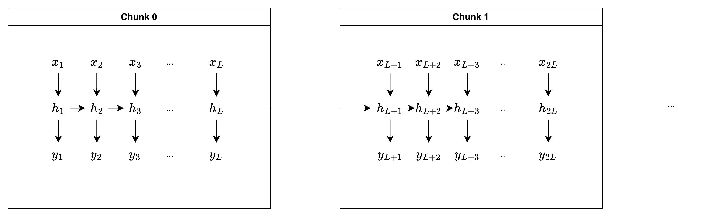
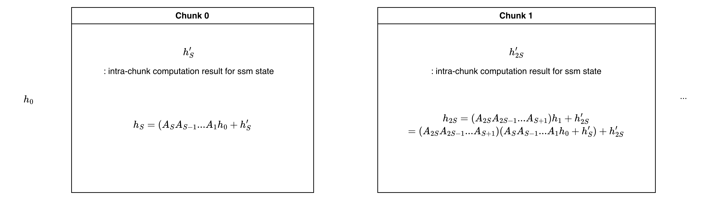

## Summary
[Mamba2: Transformers are SSMs](https://arxiv.org/abs/2405.21060) is a paper that proposes Mamba2, a new transformer model that is more efficient than the original Mamba.

## Preliminary Knowledge

### Selective State Space Model(SSM)

Selective State Space Model(SSM) is a system that describes the relationship between input and output over time.(You can think of SSM as Seq2Seq model.)

$$
h_t = A_t h_{t-1} + B_t x_t 
\\
y_t = C_t h_t + D_t x_t
$$

Where $y_t \in \mathbb{R}^{1}$ is the output at time $t$, $x_t \in \mathbb{R}^{1}$ is the input at time $t$, $h_t \in \mathbb{R}^{n}$ is the hidden state at time $t$, $A_t \in \mathbb{R}^{n \times n}$ is the ssm_state transition matrix at time $t$, $B_t \in \mathbb{R}^{n \times 1}$ is the matrix of how input contributes to ssm_state at time $t$, $C_t \in \mathbb{R}^{1 \times n}$ is the matrix of how ssm_state contributes to output at time $t$, $D_t \in \mathbb{R}^{1 \times 1}$ is the matrix of how input contributes to output at time $t$.

It is important to note that $A_t, B_t, C_t$ are time-varying matrices. But $ D_t$ are time-invariant matrices(it doesn't change over time).

## Structure of Mamba2

### Terminology

$H$: Number of Mamba Heads

$P$: Mamba Head Dimension

$N$: Dimension of SSM State

$T$: Sequence Length.

$S$: Chunk Size. We split the input sequence into chunks of size $S$. This is used at HW compatible Mamba2 implementation.

$C$: T // S. Number of Chunks after splitting the sequence of length $T$ into chunks of size $S$.

### Multiple Heads and Multi-dimension Input/Output

Mamba2 is a transformer model that is more efficient than the original Mamba. It is a selective SSM model that can handle multi-dimensional input and output. And it uses multiple heads to handle multi-dimensional input and output.

$$
x_t \in \mathbb{R}^{H \times P} \\
y_t \in \mathbb{R}^{H \times P} \\
h_t \in \mathbb{R}^{H \times P \times N}
$$

### $A_t$ is scalar

In Mamba2, $A_t$ is a scalar.

### Mamba2 Implementation - HW Incompatible Version

Following code is the implementation of Mamba2 with HW incompatible version. It is HW incompatible because computation includes Broadcasting and Element-wise Multiplication. As a result, it doesn't fully utilize the Tensor Cores(Ultra-fast Matrix Multiplication Unit) in NVIDIA GPUs.

However, it is still useful to understand the basic idea of Mamba2.

```python
"""
Given 
 - x[t]: shape (H, P)
 - y[t]: shape (H, P)
 - h[t]: shape (H, P, N)
 - A[t]: shape (H,) # Scalar per head
 - B[t]: shape (H, N) # Vector per head
 - C[t]: shape (H, N) # Vector per head
 - D[t]: shape (H,) # Scalar per head
"""

for t in range(T):
    # Calculate h[t]
    h[t] = A[t][:, None, None] * h[t-1] # (H, 1, 1) * (H, P, N) -> (H, P, N) # Broadcasting and Element-wise Multiplication
    h[t] += B[t][:, None, :] * x[t][:, :, None] # (H, 1, N) * (H, P, 1) -> (H, P, N) # Broadcasting and Element-wise Multiplication

    # Calculate y[t]
    y[t] = h[t] @  C[t][:, :, None] # (H, P, N) @ (H, N, 1) -> (H, P, 1) # Matrix Multiplication
    y[t] = y[t].squeeze() # (H, P, 1) -> (H, P) # Squeeze the last dimension
    y[t] += D[t][:, None] * x[t]  # (H, 1) * (H, P) -> (H, P) # Broadcasting and Element-wise Multiplication
```

### Mamba2 Mathematical Formulation for HW Compatible Version

In this version, we apply chunking to the input sequence. Within the chunk, we can perform the computation via matrix multiplication.



Assume we are trying to calculate 0th chunk of the input sequence. So we are processing $x_{1:S+1}, y_{1:S+1}, h_{S}$. We don't need to `get` $h_{1:S+1}$ because there is no need to be stored.(next chunk just need $h_{S}$)
$$
\begin{aligned}
h_{S-1}
&= A_{S-1} h_{S-2} + B_{S-1} x_{S-1} \\
&= A_{S-1}A_{S-2}h_{S-2} + A_{S-1}B_{S-2}x_{S-2} + B_{S-1}x_{S-1} \\
&= ... \\
&= A_{S-1}A_{S-2}...A_{1}h_{0}+ B_{S-1}x_{S-1} + A_{S-1}B_{S-2}x_{S-2} \\
& + A_{S-1}A_{S-2}B_{S-3}x_{S-3} + ... + A_{S-1}A_{S-2}...A_{1}B_{1}x_{1}
\end{aligned}
$$

Let's look at the equation for $y_{0:S}$:
$$
\begin{aligned}
y_{1} 
&= C_{1} h_{1} \\
&= C_{1} (A_{1} h_{0} + B_{1} x_{1}) \\
y_{2} &= C_{2} h_{2} \\
&= C_{2} (A_{2} h_{1} + B_{2} x_{2}) \\
&= C_{2} (A_{2} A_{1} h_{0} + A_{2} B_{1} x_{1} + B_{2} x_{2}) \\
... \\
&y_{S} = C_{S} h_{S} \\
&= C_{S} (A_{S} h_{S-1} + B_{S} x_{S}) \\
&= ... \\
\end{aligned}
$$

If you take a closer look at the equation, we can split the Right-hand side into two parts:
1. $A_{S-1}A_{S-2}...A_{1}h_{0}$: Part that is relevant to previous chunk. If we generalize the equation for $i$th chunk, then it is $A_{S-1}A_{S-2}...A_{1}h_{S \times i}$. To calculate this part, we need to know the previous chunk's ssm state $h_{S \times i}$.
2. Other parts: Part that is irrelevant to previous chunk. 

#### Intra-Chunk Computation: Part that is irrelevant to previous chunk

Let's look at the `2. Other parts` first. To calculate $h_{0 : S}$ in one go, we need to create following matrix:

1-SS Matrix:
$$
L = \begin{bmatrix}
1 & 0 & 0 & ... & 0 \\
A_{2} & 1 & 0 & ... & 0 \\
A_{3}A_{2} & A_{3} & 1 & ... & 0 \\
... & ... & ... & ... & ... \\
A_{S}A_{S-1}...A_{2} & A_{S}A_{S-1}...A_{3} & A_{S}A_{S-1}...A_{4} & ... & 1 \\
\end{bmatrix}
$$

We also need to create following matrix via matrix multiplication:

$$
\begin{aligned}
C @ B^T = \begin{bmatrix}
C_{1} B_{1} & C_{1} B_{2} & ... & C_{1} B_{S} \\
C_{2} B_{1} & C_{2} B_{2} & ... & C_{2} B_{S} \\
... & ... & ... & ... \\
C_{S} B_{1} & C_{S} B_{2} & ... & C_{S} B_{S} \\
\end{bmatrix}
\end{aligned}
$$

Now we have the ingredients to calculate part that is irrelevant to previous chunk in one go:

$$

\begin{aligned}
y_{1:S} = ((C @ B^T) * L) @ x_{1:S}
\end{aligned}
$$

#### Inter-Chunk Computation: Part that is relevant to previous chunk

Let's look at the `1. Part that is relevant to previous chunk`.



As you can see, we can parallelize the computation using Cumulative Sum(for $log(A)$) and element-wise multiplication.

### Mamba2 Implementation for HW Compatible Version

Following code is the implementation of Mamba2 with HW compatible version. It is HW compatible because computation doesn't include Broadcasting and Element-wise Multiplication. Although codes are written in einsum format, internally it uses matrix multiplication.

```python
"""
Given 
 - x[t]: shape (H, P) or x: shape (T, H, P)
 - y[t]: shape (H, P) or y: shape (T, H, P)
 - h[t]: shape (H, P, N) or h: shape (T, H, P, N)
 - A[t]: shape (H,) # Scalar per head or A: shape (T, H)
 - B[t]: shape (H, N) # Vector per head or B: shape (T, H, N)
 - C[t]: shape (H, N) # Vector per head or C: shape (T, H, N)
 - D[t]: shape (H,) # Scalar per head or D: shape (T, H)
"""

def segsum(x):
    """Naive segment sum calculation. exp(segsum(A)) produces a 1-SS matrix,
       which is equivalent to a scalar SSM."""
    T = x.size(-1)
    x_cumsum = torch.cumsum(x, dim=-1)
    x_segsum = x_cumsum[..., :, None] - x_cumsum[..., None, :]
    mask = torch.tril(torch.ones(T, T, device=x.device, dtype=bool), diagonal=0)
    x_segsum = x_segsum.masked_fill(~mask, -torch.inf)
    return x_segsum

# Split x, A, B, C into chunks of size S
x, A, B, C = [rearrange(m, '(c l) ... -> c l ...', l=S) for m in (x, A, B, C)]

# x: shape (C, S, H, P)
# A: shape (C, S, H)
# B: shape (C, S, H, N)
# C: shape (C, S, H, N)

# A: shape (C, S, H) -> (H, C, S)
A = rearrange(A, 'c s h -> h c s')

# 1. Compute the output for each intra-chunk
L = torch.exp(segsum(A))
Y_intrachunk = torch.einsum('clhn,cmhn,hclm,cmhp->clhp', C, B, L, x)

# 2. Compute the state for each intra-chunk
A_cumsum = torch.cumsum(A, dim=-1)
decay_states = torch.exp(A_cumsum[:, :, -1:] - A_cumsum) # shape: (H, C, S)
h_intrachunk = torch.einsum('cshn,hcs,cshp->chpn', B, decay_states, x)

# 3. Compute the state for inter-chunk
if initial_states is None:
    initial_states = torch.zeros_like(h_intrachunk[:1]) # shape: (1, H, P, N)

h_intrachunk = torch.cat([initial_states, h_intrachunk], dim=0)

decay_chunk = torch.exp(segsum(F.pad(A_cumsum[:, :, -1], (1, 0)))) # shape: (H, C+1, S)
new_states = torch.einsum('hzs,chpn->zhpn', decay_chunk, h_intrachunk) # (C+1, H, P, N)

states, final_state = new_states[:, :-1], new_states[:, -1]

# Since we got each chunk's final state, we can use this to get output.
state_decay_out = torch.exp(A_cumsum)
Y_interchunk = torch.einsum('cshn,chpn,hcs->cshp', C, states, state_decay_out)

Y = Y_intrachunk + Y_interchunk

Y = rearrange(Y, 'c l h p -> (c l) h p')
return Y, final_state

```