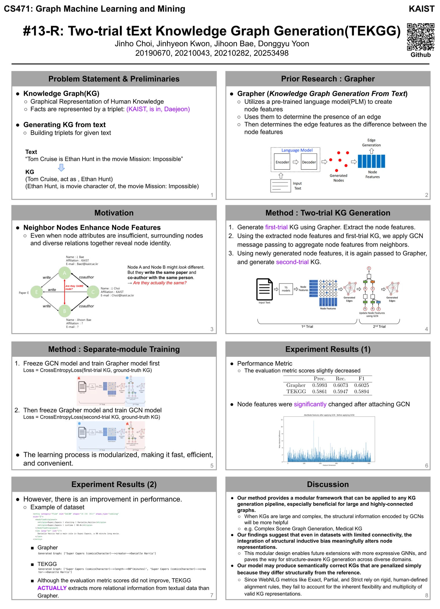

## Summary

This is a research project at KAIST CS471 Graph Machine Learning and Mining.

TEKGG is a two-trial text knowledge graph generation model that generates text knowledge graph from text data.

## Implementation

[TEKGG Implementation](https://github.com/jinho-choi123/advanced-Grapher/tree/artifact-evaluation)

## Poster

